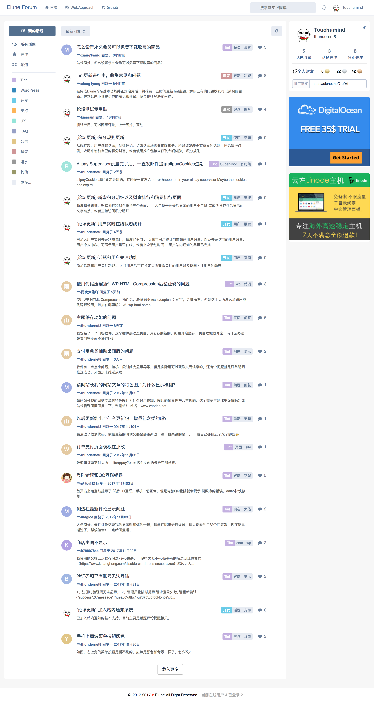
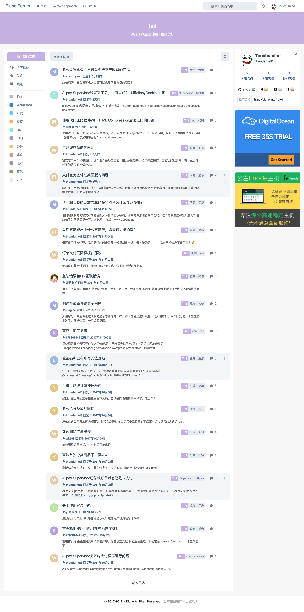
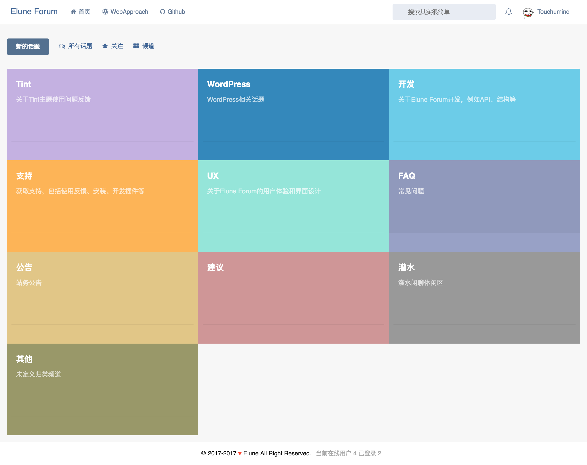
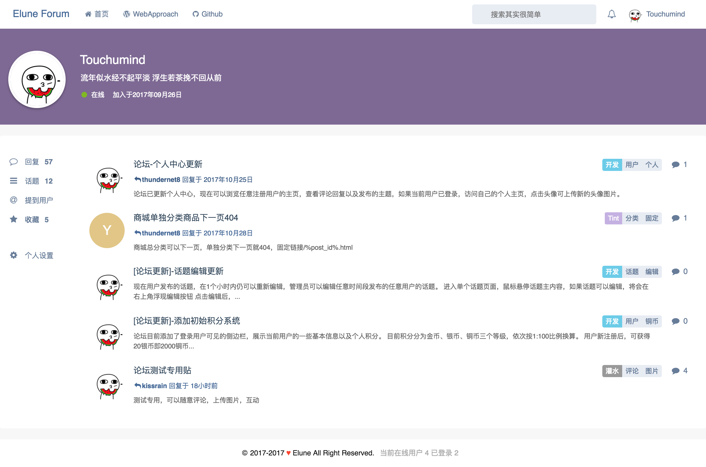
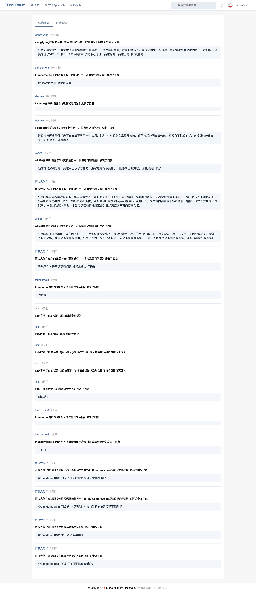
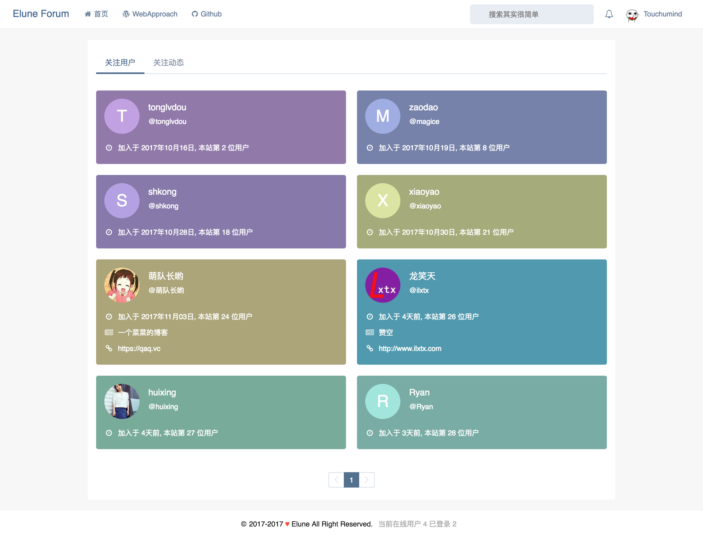
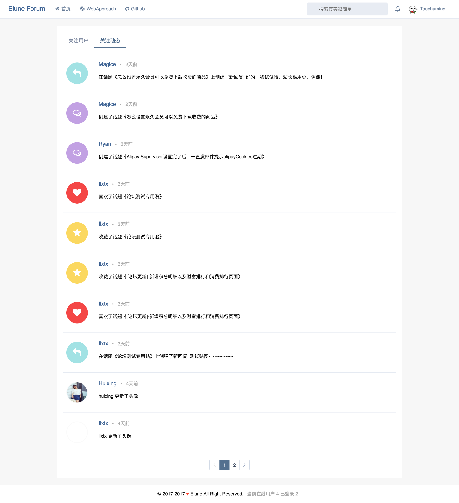
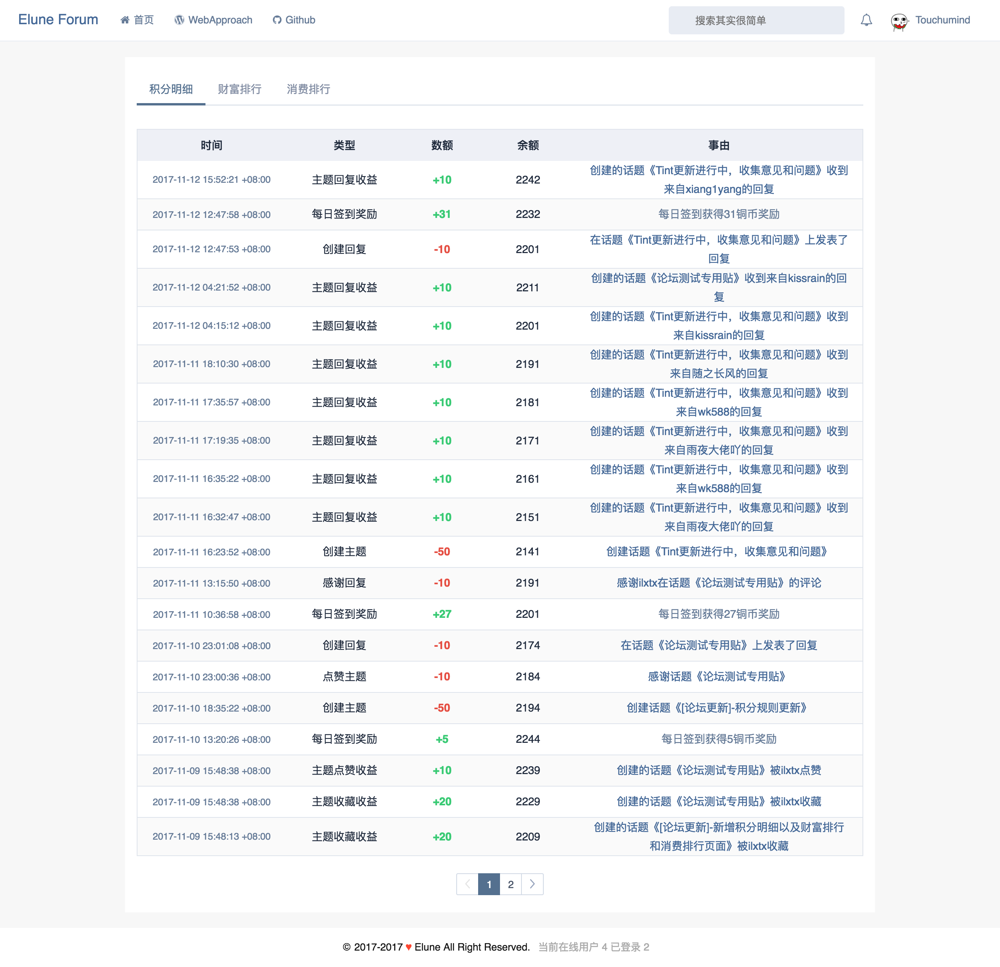
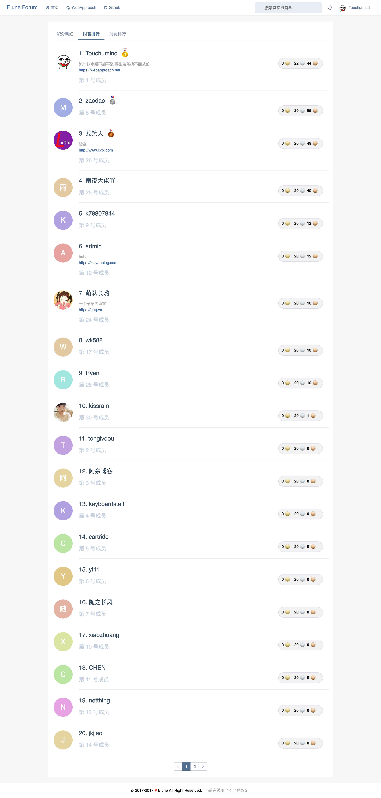
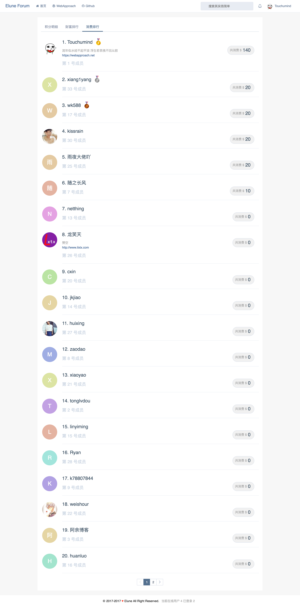

## Elune

基于Java和[Razor MVC框架](https://github.com/thundernet8/Razor)开发的轻论坛程序后台API服务部分，前台部分见[Elune](https://github.com/thundernet8/Elune-WWW)。

示例站点 [Elune Forum](https://elune.me)

## Screenshots

